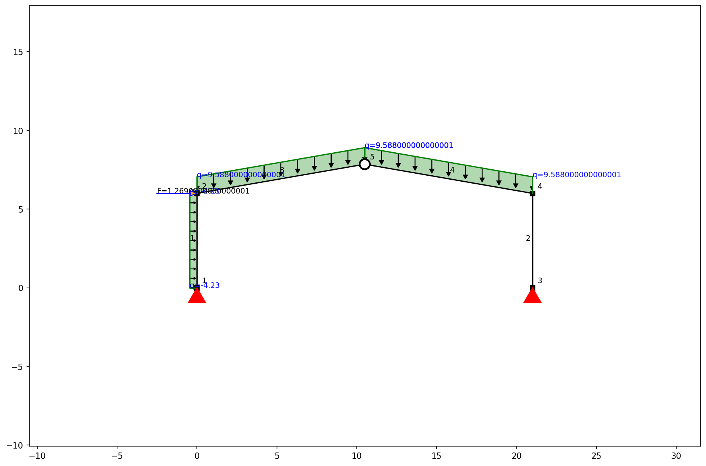
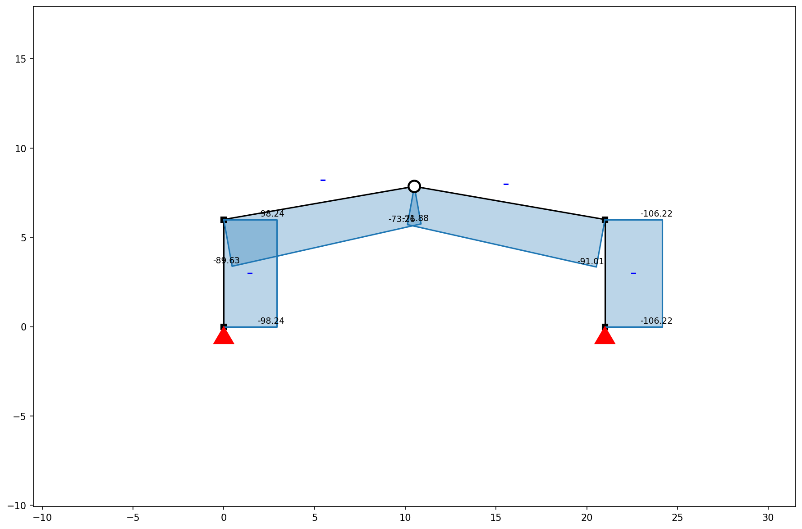
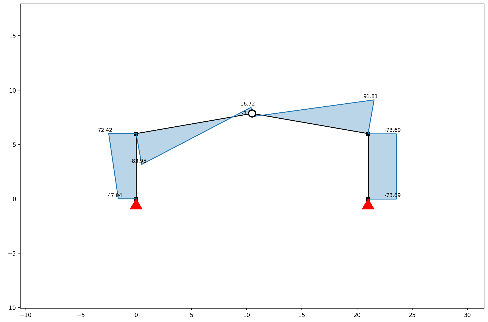
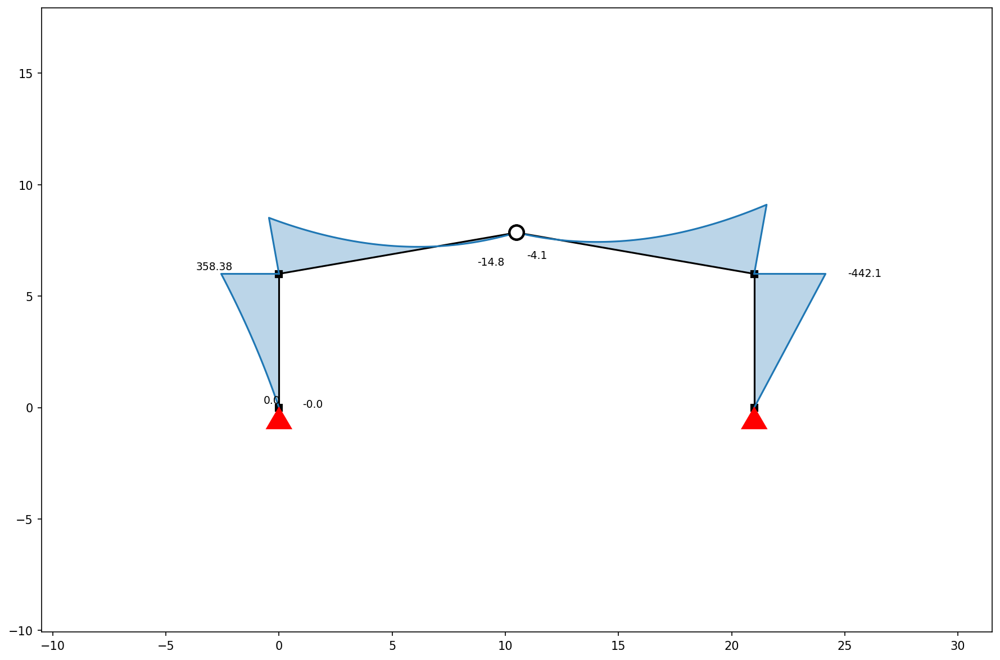
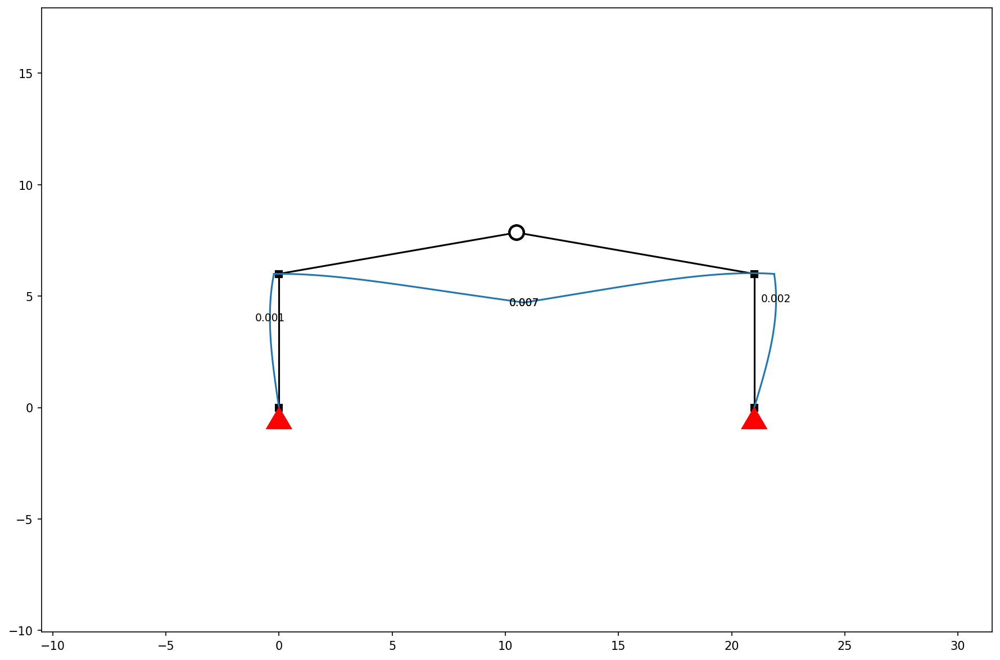
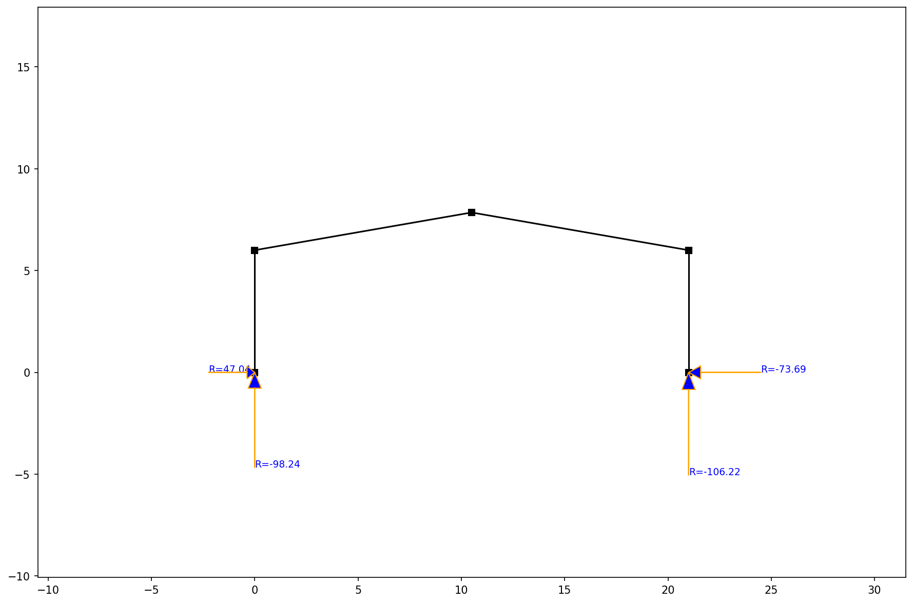

# Gable Roof Structural Analysis Report

## 1. Frame Geometry & Loads
- **Span:** `21.0 m`
- **Column Height:** `6.0 m`
- **Max Vertical Deflection:** `7.41 mm` (Limit: 87.50 mm)

## 2. Loading Data (NSCP 2015 Combinations)
- **Frame Spacing:** `4.7 m` (Tributary Width)
- **Dead Load (DL):** `0.9 kPa \times 4.7m = 4.23 kN/m`
- **Roof Live Load (LR):** `0.6 kPa \times 4.7m = 2.82 kN/m`
- **Governing Combination ($1.2D + 1.6L$):** `1.2(4.23) + 1.6(2.82) = 9.59 kN/m` (Applied as UDL)

### Optimized Member Selection
| Group | Selected W-Shape | Weight (plf) | Area (in²) | Ix (in⁴) |
| --- | --- | --- | --- | --- |
| Beam | `W6X15` | 15.0 | 4.43 | 29.1 |
| Column | `W6X8.5` | 8.5 | 2.52 | 14.9 |

- **Total Steel Weight (per frame):** `627.7 kg`
- **Estimated Material Cost:** `PHP 40,802.24` (@ PHP 65/kg)

## 2. Foundation Design (Base Plate, Pedestal & Footing)
### Base Plate Details
| Parameter | Value |
| --- | --- |
| Dimensions ($B \times N$) | `300mm x 300mm` |
| Thickness ($t$) | `16mm` |
| Anchor Bolts | `4 nos. 20mm \phi A325 Bolts` |
| Grout Thickness | `25 mm` |

### Concrete Pedestal
| Parameter | Value |
| --- | --- |
| Dimensions | `500mm x 500mm` |
| Vertical Load ($P_u$) | `98.24 kN` |
| Vertical Reinforcement | `8 nos. 16mm \phi Bars` |
| Lateral Ties | `10mm \phi @ 200mm o.c.` |
| Concrete Strength ($f'_c$) | `21 MPa (3000 psi)` |

### Isolated Square Footing
| Parameter | Value |
| --- | --- |
| Dimensions | `1.5m x 1.5m` |
| Thickness | `0.40 m` |
| Depth of Bottom | `1.50 m below Ground Level` |
| Main Reinforcement | `12mm \phi @ 150mm o.c. (Bottom BW)` |
| Soil Bearing Cap | `120 kPa (Assumed)` |

## 3. Visualizations
### Frame Structure & Loads

### Axial Force Diagram

### Shear Force Diagram

### Bending Moment Diagram

### Displacement Plot

### Reaction Forces

