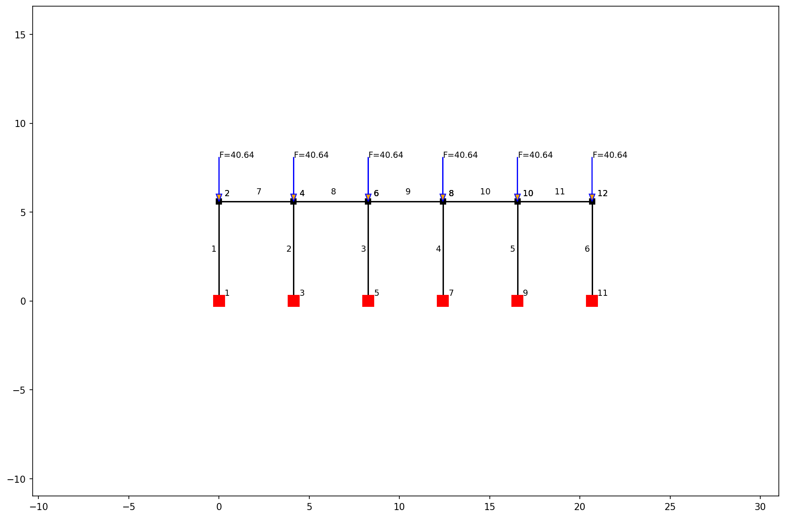

# Structural Optimization Report

## 1. Longitudinal Truss (WT Chords, Single Angle Webs)

- **Max Deflection:** `0.16 mm`
- **Deflection Ratio (L/d):** `117611` (Target > 240) ✅ PASS

### Optimized Member Selection

| Group | Selected Shape | Weight (plf) | KL/r | Max Axial Force (kN) | Capacity (kN) |
| --- | --- | --- | --- | --- | --- |
| Top Chord | `WT4X9` | 9.0 | 40.4 | -336.32 | 347.82 |
| Bottom Chord | `WT3X6` | 6.0 | 53.4 | 333.10 | 220.73 |
| Vertical Webs | `L2X2X1/8` | 1.6 | 60.4 | -43.08 | 58.39 |
| Diagonal Webs | `L3X3X3/16` | 3.7 | 88.0 | -90.62 | 104.49 |
| Columns | `W8X28` | 28.0 | 199.3 | -43.23 | 208.76 |

- **Max Support Reaction (Vertical):** `-43.23 kN`
- **Total Truss Weight:** `1242.0 kg`
- **Estimated Material Cost:** `PHP 74,520.49` (@ PHP 60/kg)

#### Structure & Applied Loads

#### Internal Axial Forces

#### Deflection Curve

#### Support Reactions

## 1B. Longitudinal Truss (Alternative Double Angle Chords)

- **Max Deflection:** `0.15 mm`
- **Deflection Ratio (L/d):** `123560` (Target > 240) ✅ PASS

### Alternative Member Selection (Double Angles)

| Group | Selected Shape | Weight (plf) | KL/r | Max Axial Force (kN) | Capacity (kN) |
| --- | --- | --- | --- | --- | --- |
| Top Chord | `2L3X3X1/4` | 9.8 | 49.7 | -336.32 | 364.38 |
| Bottom Chord | `2L3X2X3/16X3/8LLBB` | 6.1 | 53.0 | 333.14 | 227.48 |
| Vertical Webs | `L2X2X1/8` | 1.6 | 60.4 | -43.08 | 58.39 |
| Diagonal Webs | `L3X3X3/16` | 3.7 | 88.0 | -90.62 | 104.49 |
| Columns | `W8X28` | 28.0 | 199.3 | -43.23 | 208.76 |

- **Max Support Reaction (Vertical):** `-43.23 kN`
- **Total Truss Weight:** `1268.2 kg`
- **Estimated Material Cost:** `PHP 76,091.70` (@ PHP 60/kg)

## 1C. Alternative Substructure (Concrete Square Column & Isolated Footing)

Based on the maximum vertical support reaction and an 8.2m unbraced column height, the following alternative concrete substructure is proposed:

### Concrete Square Column Option
| Parameter | Value |
| --- | --- |
| Concrete Strength ($f'_c$) | `21 MPa (3000 psi)` |
| Rebar Yield Strength ($f_y$) | `275 MPa (Grade 40)` |
| Target Axial Load ($P_u$) | `43.23 kN` |
| Target Moment ($M_u$) | `6.48 kN-m` (Assumed $e=150mm$) |
| Dimensions | `300 mm x 300 mm` |
| Main Reinforcement | `4 - 20mm Ø bars` (To meet minimum 1% $A_s$) |
| Lateral Ties | `10mm Ø @ 300mm O.C.` |

### Isolated Square Footing Option
| Parameter | Value |
| --- | --- |
| Concrete Strength ($f'_c$) | `21 MPa (3000 psi)` |
| Rebar Yield Strength ($f_y$) | `275 MPa (Grade 40)` |
| Assumed Allowable Soil Bearing | `100 kPa` |
| Dimensions (L x W x T) | `1.0m x 1.0m x 0.30m` |
| Bottom Reinforcement | `12mm Ø @ 200mm O.C.` (Both Ways) |

## 2. Transverse Moment Frame

#### Structure & Applied Loads

#### Internal Axial Forces

#### Deflection Curve

#### Support Reactions

