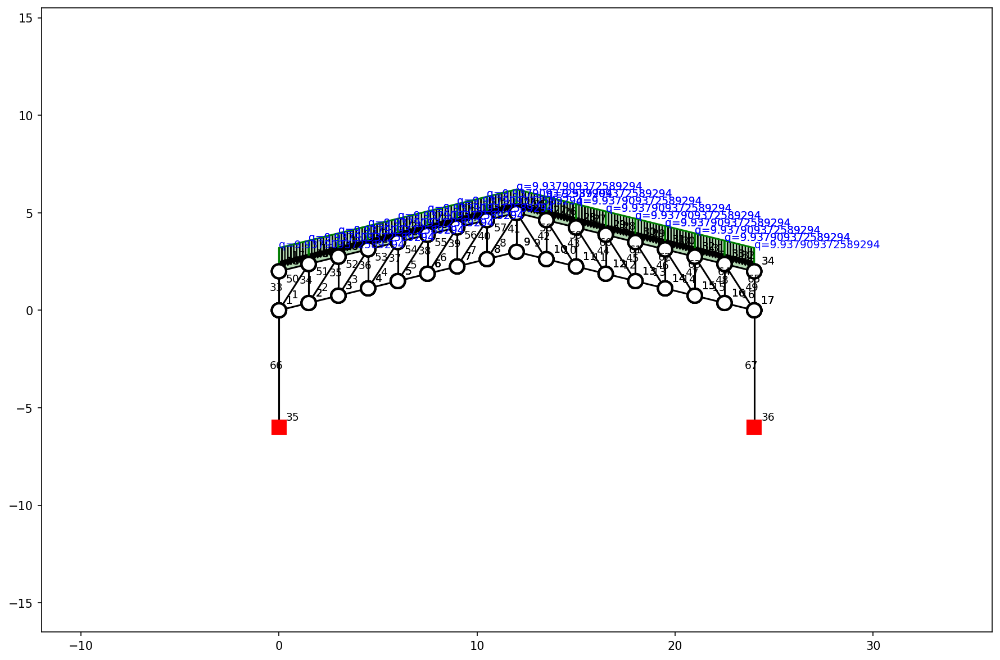
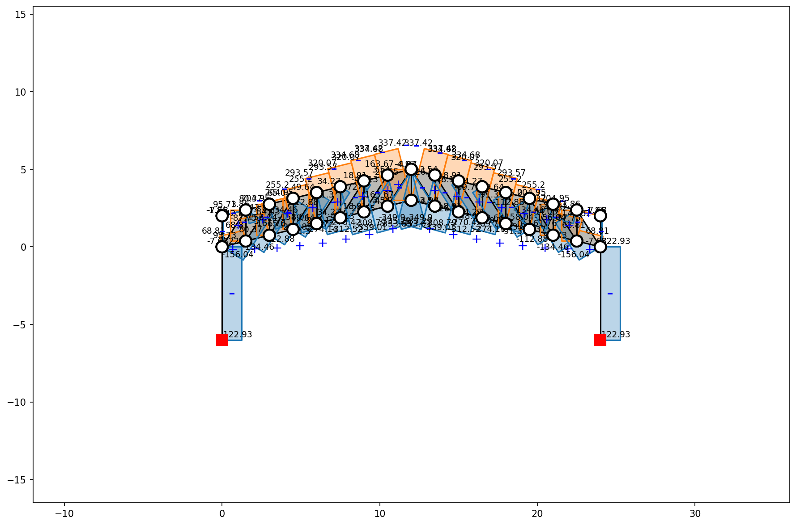
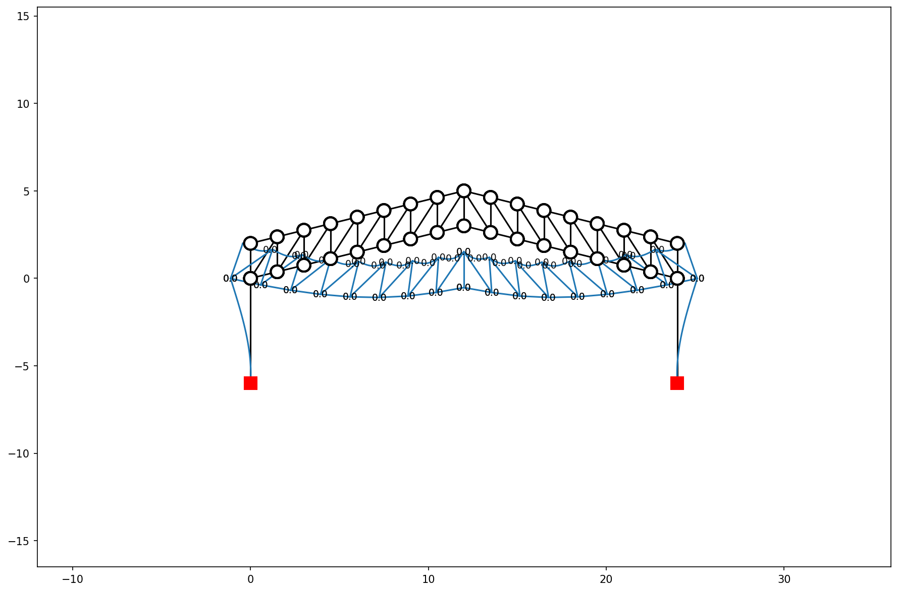
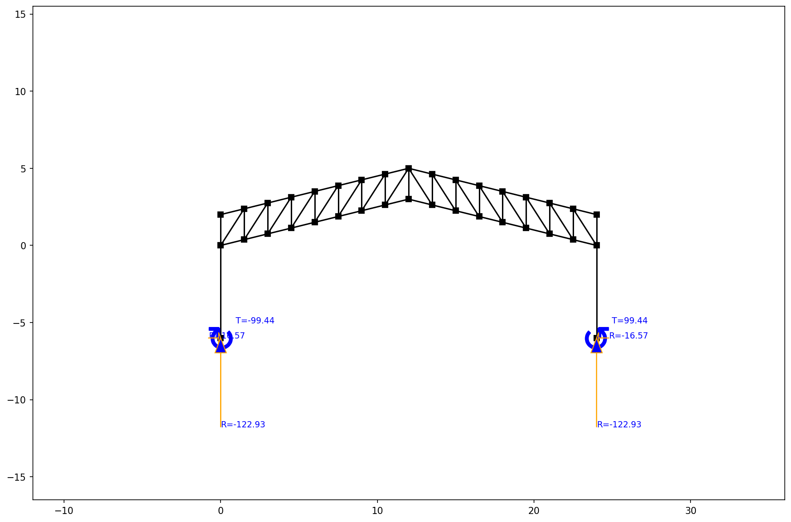
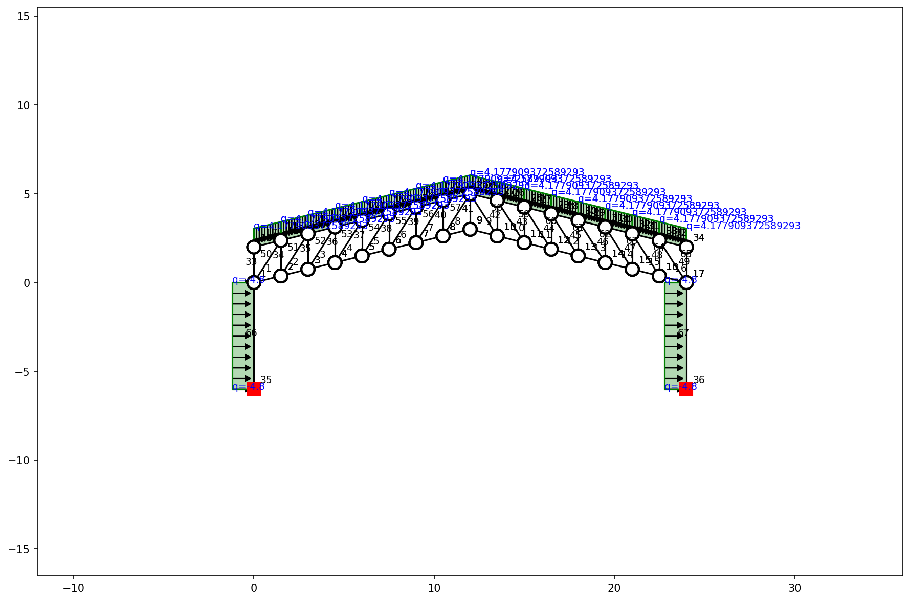
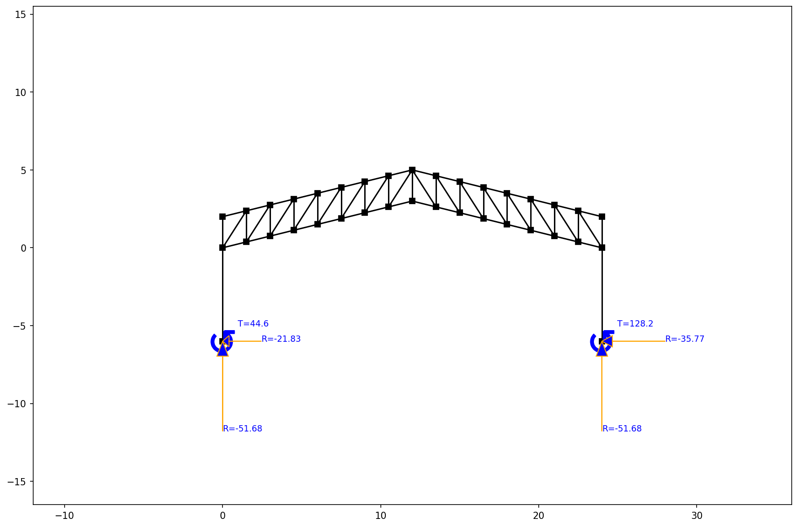

# Pickleball Court — Structural Optimization Report

## 1. Truss Configuration

| Parameter | Value |
| --- | --- |
| Span | `24.0 m` |
| Depth | `2.0 m` (constant between chords) |
| Center Rise | `3.0 m` |
| Column Height | `6.0 m` (fixed base) |
| Panels | `16 @ 1.5 m` |
| Type | Two-Slope (Gable) Symmetrical Pratt Truss |
| Supports | Fixed-base steel columns (2 nos.) |
| Steel Grade | `A36 (Fy = 36 ksi)` |

## 2. Applied Loads

### Gravity Loads

| Component | Value |
| --- | --- |
| Dead Load (Roof + Ceiling) | `3.0 kN/m` (0.5 kPa × 6m trib.) |
| Truss Self-Weight | `0.482 kN/m` (1506.7 kg / 24m) |
| **Total Dead Load (D)** | **`3.482 kN/m`** |
| **Live Load (L)** | **`3.600 kN/m`** (0.6 kPa × 6m trib.) |

### Earthquake (Static Method — NSCP)

| Parameter | Value |
| --- | --- |
| Seismic Coefficient ($C_s$) | `0.2` (Zone 4, Soil Type D, R=8.5) |
| Seismic Weight ($W$) | `83.56 kN` |
| Base Shear ($V = C_s \times W$) | **`16.71 kN`** |
| Lateral q on each column ($V / 2 / h$) | `1.39 kN/m` |

### Wind Load

| Parameter | Value |
| --- | --- |
| Wind Pressure | `800 Pa` |
| Tributary Width | `6.0 m` |
| Lateral Load on Columns | **`4.8 kN/m`** (800 Pa × 6m) |

## 3. Load Case Summary

### Axial Forces (kN) per Load Case

| Member Group | LC1 — Gravity Only | LC2 — Gravity + EQ | LC3 — Gravity + Wind | **Governing** |
| --- | --- | --- | --- | --- |
| Top Chord | 163.67 | 128.10 | 68.81 | **163.67** |
| Bottom Chord | -353.63 | -276.77 | -148.67 | **-353.63** |
| Vertical Webs | -156.04 | -122.12 | -65.60 | **-156.04** |
| Diagonal Webs | 0.00 | 0.00 | 0.00 | **0.00** |
| Columns | 122.93 | 96.21 | 51.68 | **122.93** |

### Support Reactions per Load Case

| Reaction | LC1 — Gravity Only | LC2 — Gravity + EQ | LC3 — Gravity + Wind | **Governing** |
| --- | --- | --- | --- | --- |
| Vertical ($F_y$) | 122.93 | 96.21 | 51.68 | **122.93** |
| Horizontal ($F_x$) | 16.57 | 21.33 | 35.77 | **35.77** |

> **Governing Vertical Reaction:** `122.93 kN` (LC1: Gravity Only)
> **Governing Horizontal Reaction:** `35.77 kN` (LC3: Gravity + Wind)

## 4. Deflection Check

- **Max Deflection:** `0.10 mm`
- **Deflection Ratio (L/d):** `239419` (Target > 240) ✅ PASS

## 5. Optimized Member Selection (Governing Forces)

| Group | Selected Shape | Weight (plf) | KL/r | Gov. Force (kN) | Capacity (kN) | Governing LC |
| --- | --- | --- | --- | --- | --- | --- |
| Top Chord | `WT3X4.25` | 4.2 | 35.9 | 163.67 | 181.59 | Gravity Only |
| Bottom Chord | `WT4X9` | 9.0 | 26.7 | -353.63 | 365.08 | Gravity Only |
| Vertical Webs | `HSS4.000X0.125` | 5.2 | 57.5 | -156.04 | 171.99 | Gravity Only |
| Diagonal Webs | `HSS2X1X1/8` | 2.2 | 233.4 | 0.00 | 87.63 |  |
| Columns | `W6X15` | 15.0 | 162.9 | 122.93 | 167.74 | Gravity Only |

- **Total Steel Weight:** `1506.7 kg`
- **Estimated Steel Cost:** `PHP 90,402.93` (@ PHP 60/kg)

## 6. Substructure Design

Design assumptions:

| Parameter | Value |
| --- | --- |
| Concrete Strength ($f'_c$) | `21 MPa (3000 psi)` |
| Rebar Yield Strength ($f_y$) | `275 MPa (Grade 40)` |
| Allowable Soil Bearing ($q_a$) | `100 kPa` |
| Governing Vertical Reaction ($P_u$) | `122.93 kN` |
| Governing Horizontal Reaction ($H_u$) | `35.77 kN` |

### Steel Base Plate

| Parameter | Value |
| --- | --- |
| Column Shape | `W6X15` (d ≈ 152mm, bf ≈ 152mm) |
| Base Plate Dimensions (B × N) | `252 mm × 252 mm` |
| Base Plate Thickness ($t_p$) | `10 mm` |
| Actual Bearing Stress | `1.94 MPa` ≤ `11.60 MPa` (✅) |
| Anchor Bolts | `4 — 16mm Ø` |

### Concrete Pedestal

| Parameter | Value |
| --- | --- |
| Dimensions | `400 mm × 400 mm × 600 mm` |
| Main Reinforcement | `4 — 16mm Ø bars` |
| Lateral Ties | `10mm Ø @ 200mm O.C.` |
| Anchor Bolts | `4 — 16mm Ø` (embedded 500mm) |

### Isolated Square Footing

| Parameter | Value |
| --- | --- |
| Dimensions | `1.0 m × 1.0 m × 0.30 m` |
| Actual Bearing Pressure | `82.0 kPa` ≤ `100 kPa` ✅ |
| Bottom Reinforcement | `12mm Ø @ 200mm O.C.` (Both Ways) |

## 7. Structural Plots

#### Structure & Applied Loads (Gravity)

#### Axial Forces (Gravity)

#### Deflection (Gravity)

#### Support Reactions (Gravity)

#### Structure & Loads (Wind Case)

#### Axial Forces (Wind Case)

#### Reactions (Wind Case)

