# Structural Optimization Report

## 1. Longitudinal Truss (Optimized)

- **Max Deflection:** `0.13 mm`
- **Deflection Ratio (L/d):** `140948` (Target > 240) ✅ PASS

### Optimized Member Selection

| Group | Selected Shape | Weight (plf) | KL/r | Max Axial Force (kN) | Capacity (kN) |
| --- | --- | --- | --- | --- | --- |
| Top Chord | `WT3X4.25` | 4.2 | 54.3 | -168.21 | 203.27 |
| Bottom Chord | `WT3X4.25` | 4.2 | 54.3 | 168.14 | 252.21 |
| Vertical Webs | `L2X2X1/8` | 1.6 | 60.4 | -21.54 | 58.39 |
| Diagonal Webs | `L2-1/2X2X3/16` | 2.8 | 121.1 | -45.42 | 54.50 |

- **Max Support Reaction (Vertical):** `-21.54 kN`

#### Structure & Applied Loads
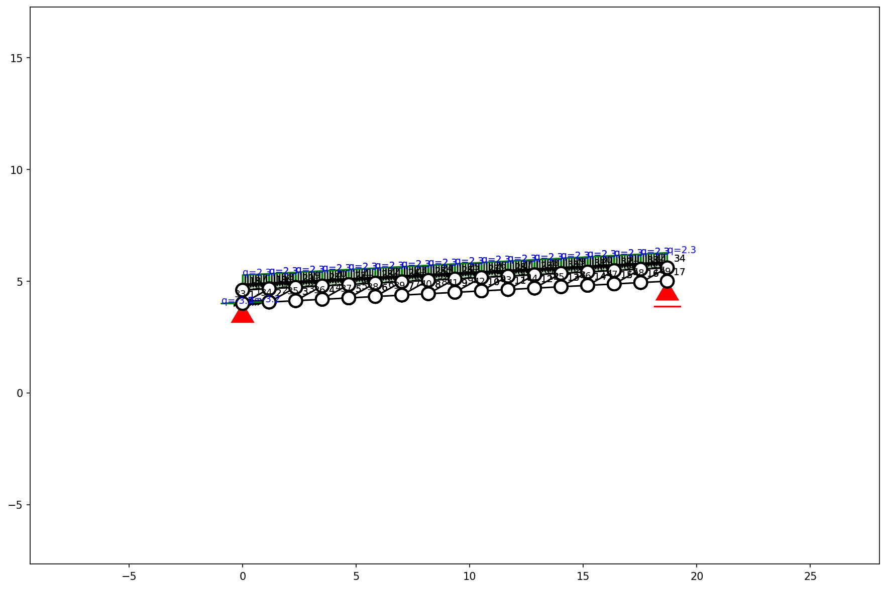

#### Internal Axial Forces
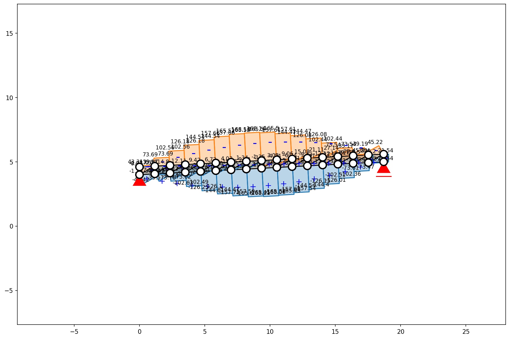

#### Deflection Curve
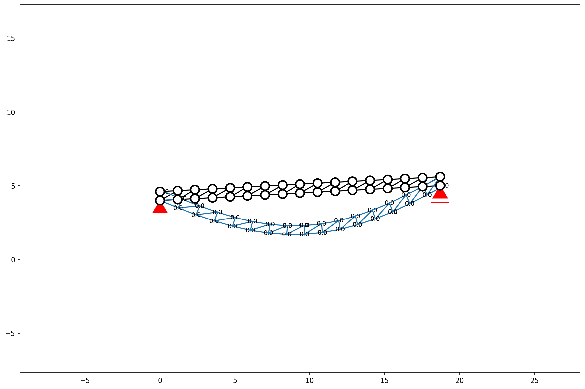

#### Support Reactions
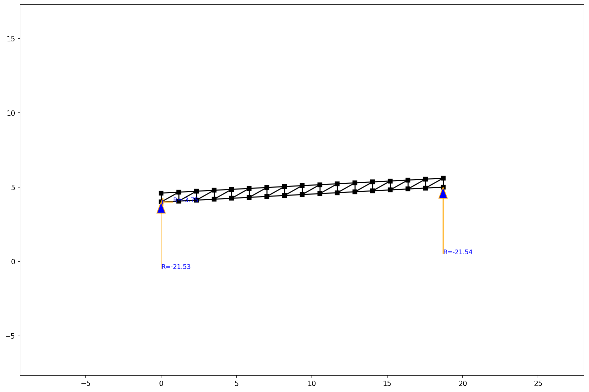

## 1B. Longitudinal Truss (Alternative Double Angle Chords)

- **Max Deflection:** `0.12 mm`
- **Deflection Ratio (L/d):** `160518` (Target > 240) ✅ PASS

### Alternative Member Selection (Double Angles)

| Group | Selected Shape | Weight (plf) | KL/r | Max Axial Force (kN) | Capacity (kN) |
| --- | --- | --- | --- | --- | --- |
| Top Chord | `2L2-1/2X1-1/2X3/16X3/4LLBB` | 4.9 | 57.6 | -168.21 | 175.51 |
| Bottom Chord | `2L2X2X3/16` | 4.9 | 75.3 | 168.14 | 207.54 |
| Vertical Webs | `L2X2X1/8` | 1.6 | 60.4 | -21.54 | 58.39 |
| Diagonal Webs | `L2-1/2X2X3/16` | 2.8 | 121.1 | -45.42 | 54.50 |

- **Max Support Reaction (Vertical):** `-21.54 kN`

## 2. Transverse Stiffening Truss

- **Transfer Load (from Longitudinal):** `21.50 kN` per node
- **Max Deflection:** `9318.07 mm`

### Member Selection

| Group | Selected Shape | Weight (plf) | KL/r | Max Axial Force (kN) | Capacity (kN) |
| --- | --- | --- | --- | --- | --- |
| TS Top Chord | `HSS9.625X0.188` | 19.0 | 12.2 | -926.07 | 942.63 |
| TS Bottom Chord | `HSS5.000X0.375` | 18.5 | 24.7 | 926.07 | 939.20 |
| TS Vertical Webs | `L2-1/2X2X3/16` | 2.8 | 55.5 | -96.75 | 100.27 |
| TS Diagonal Webs | `L2X2X3/8` | 4.7 | 121.9 | 192.74 | 197.45 |

#### Structure & Applied Loads
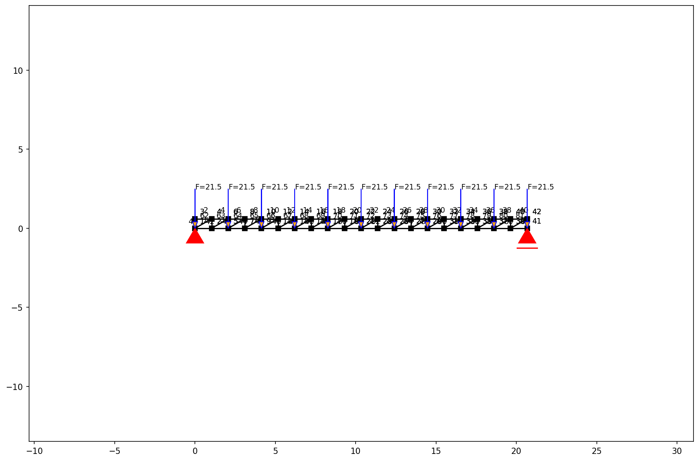

#### Internal Axial Forces
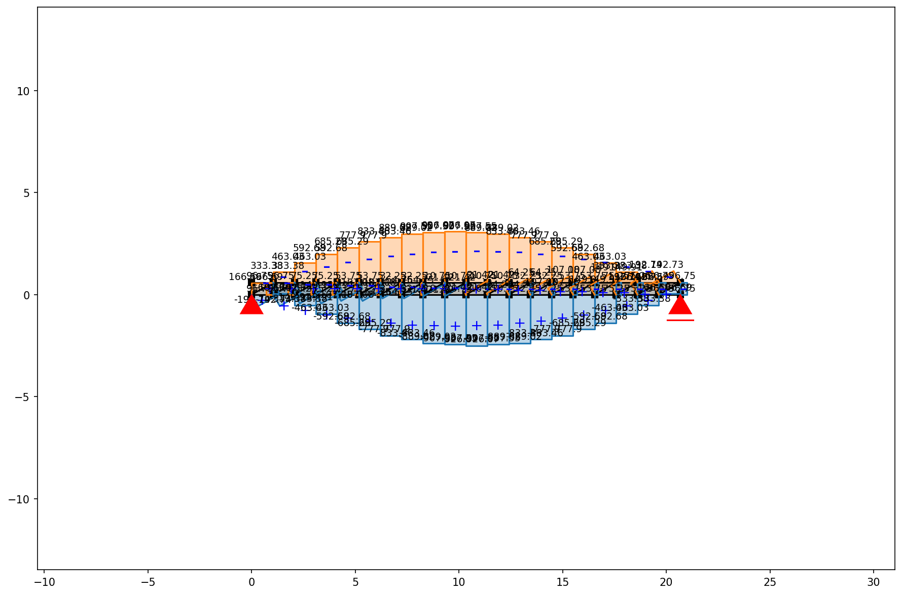

#### Deflection Curve
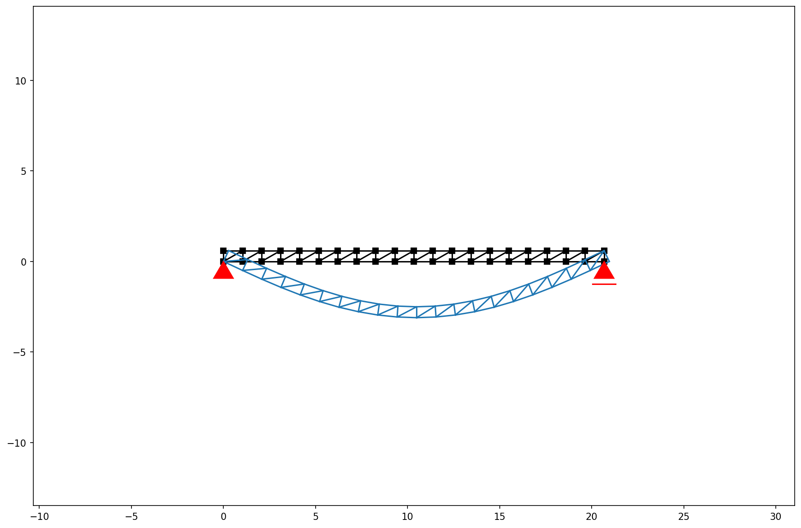

#### Support Reactions
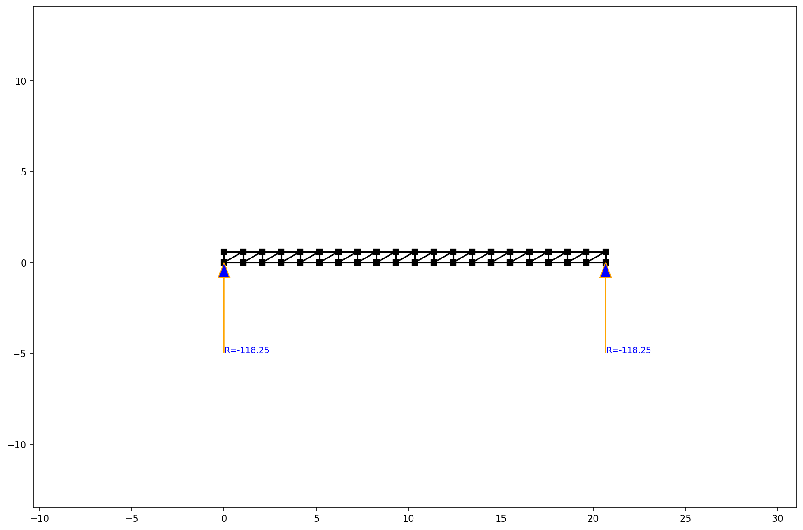

## 3. Transverse Moment Frame

#### Structure & Applied Loads

#### Internal Axial Forces
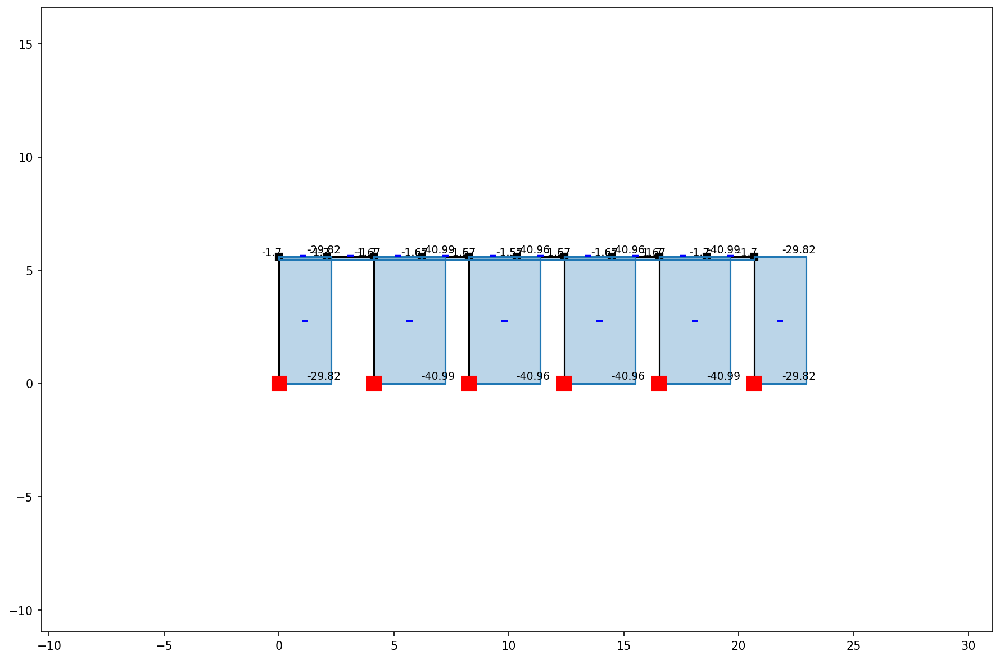

#### Deflection Curve
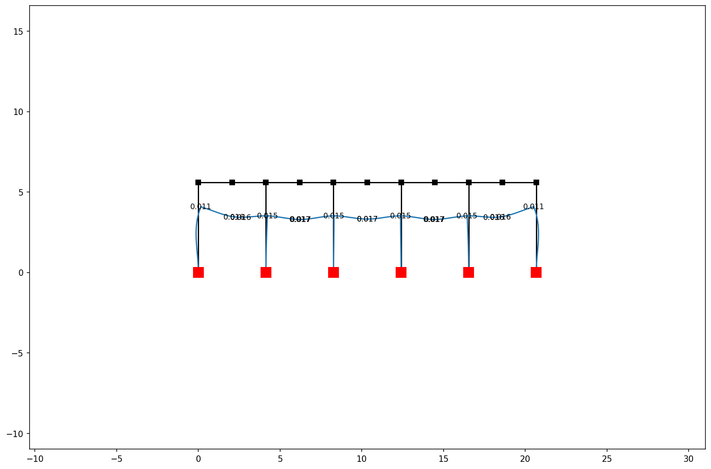

#### Support Reactions
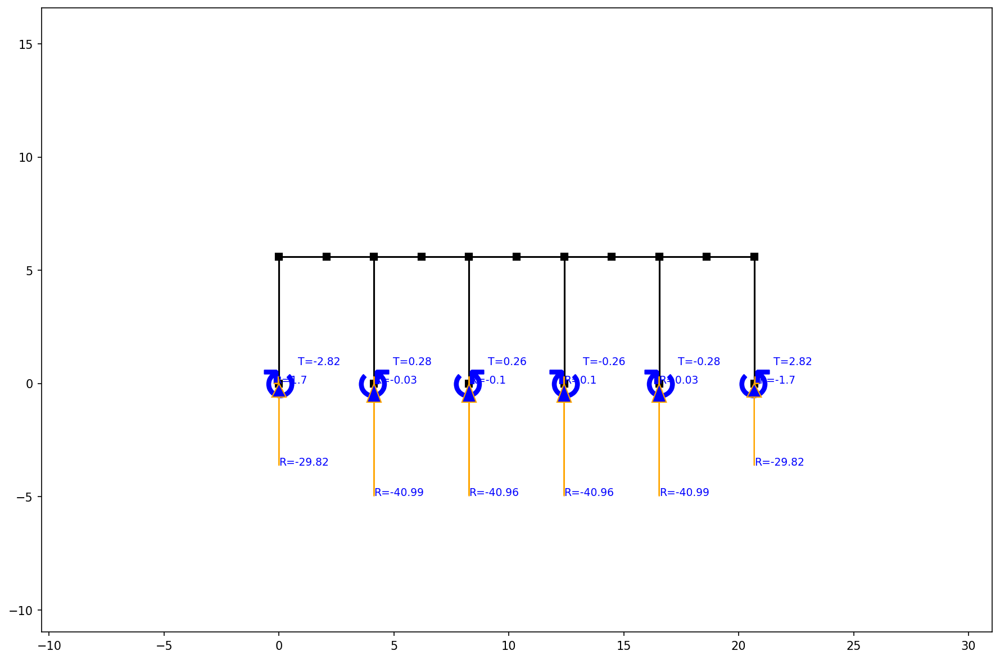
